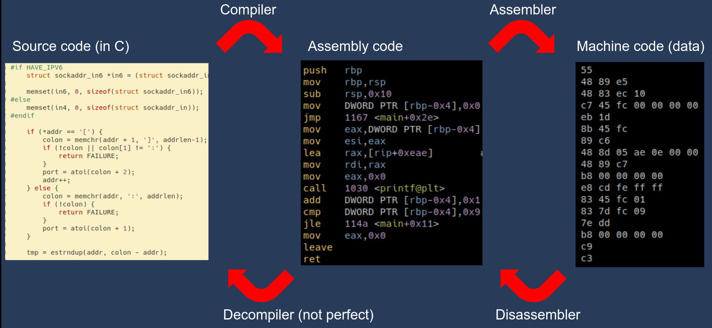

# Reverse engineering / Assembly crash course

[First](#background), some theoretical background on what reverse
engineering is, what assembly is, and some concepts which are good to
know. [Then](#methodology) there are some tips on how you practically go
about reversing a program. Some essential [tools](#tools) are listed which
you should install. [Finally](#extras), there are some extra tips and tricks
at the bottom.

## Background

In normal (forward) engineering, your task is to take ideas, concepts,
and designs, and turn them into a product, or piece of software. In
reverse engineering, it's the other way around. Given the output of the
engineering process, can you determine what the original design, concept,
or plan was? Practically, this often means reading a lot of code and trying
to put yourself in the shoes of the original program authors.

In CTFs, we are usually interested in reverse engineering binary programs. Most
often, the programs were originally written in C. (If they were written in
something else like C++, Go, Rust, or Swift, things get more challenging.) You
are usually given just the compiled program. Your task is then to:

1. Figure out what the program does
2. Figure out where the flag is
3. Make the program give you the flag / Use the program to figure out the flag

Below is a diagram of the usual compilation process in C. A compiler takes
your source code and produces assembly, which is fed to an assembler, which
produces a binary executable (program). This is the starting point for the
reverse engineer. Similarly to the normal compilation process, but in reverse,
you can use a disassembler to get assembly code from a compiled binary, and
use that with a decompiler to get an approximation of the original source code.



Here is some terminology:

- **Assembler**: Takes assembly code and gives machine code.
- **Disassembler**: Inverse of assembler. Takes machine code and gives assembly code (text).
- **Decompiler**: Inverse of compiler. Tries to reverse the compiled binary back to source code.

Below we go through some concepts which are good to know when dealing with
assembly and binaries.

### Static vs. Dynamic reversing

When reversing dynamically, you typically run the program and inspect its
behavior. For example using a debugger `gdb` or some other tracing program
(`strace` or `ltrace`). When reversing statically, you do not run the
application. Instead you read the disassembly and decompilation and think
about what it is doing.

### Representing things with bytes


### Endianness


### Packing in Python

- https://docs.python.org/3/library/struct.html
- https://docs.pwntools.com/en/latest/intro.html#packing-integers

### Assembly

Assembly code is what your CPU actually runs ([not actually, but close
enough](https://en.wikipedia.org/wiki/Microcode)). Or rather, your CPU runs
machine code, and assembly code is a one-to-one textual representation of the
machine code. Assembly code contains a list of instructions. Each instruction
performs some small task. You can think about assembly code like just a
programming language (because it is) where every instruction is very primitive.

There are many different types of assembly code: x86, ARM, MIPS, SPARC,
Power PC, z80, etc. In this document, we will focus on x86-64, the 64-bit
version of x86. It is the most common architecture on laptops, desktops,
and servers at the moment. ARM is most common on handheld devices such as
smartphones, etc. We will see what happens in the future, if ARM will take
over the desktop market.

- mention and show objdump


### Disassembling with objdump

Example C code:

```c
#include <stdio.h>

int main() {
  for(int i = 0; i < 10; i++) {
    printf("i: %d\n", i);
  }
}
```

Compile with `gcc code.c` to get `a.out`. To disassemble `a.out` and get
the assembly code, use `objdump -d -M intel a.out`:

```
...
0000000000001139 <main>:
    1139:	55                   	push   rbp
    113a:	48 89 e5             	mov    rbp,rsp
    113d:	48 83 ec 10          	sub    rsp,0x10
    1141:	c7 45 fc 00 00 00 00 	mov    DWORD PTR [rbp-0x4],0x0
    1148:	eb 1d                	jmp    1167 <main+0x2e>
    114a:	8b 45 fc             	mov    eax,DWORD PTR [rbp-0x4]
    114d:	89 c6                	mov    esi,eax
    114f:	48 8d 05 ae 0e 00 00 	lea    rax,[rip+0xeae]        # 2004 <_IO_stdin_used+0x4>
    1156:	48 89 c7             	mov    rdi,rax
    1159:	b8 00 00 00 00       	mov    eax,0x0
    115e:	e8 cd fe ff ff       	call   1030 <printf@plt>
    1163:	83 45 fc 01          	add    DWORD PTR [rbp-0x4],0x1
    1167:	83 7d fc 09          	cmp    DWORD PTR [rbp-0x4],0x9
    116b:	7e dd                	jle    114a <main+0x11>
    116d:	b8 00 00 00 00       	mov    eax,0x0
    1172:	c9                   	leave
    1173:	c3                   	ret```
...
```

### Assembly syntax variations

When `objdump` is called with the `-M intel` flag, it prints the assembly
with the intel syntax. This is the preferred syntax. There is also the AT&T /
GNU AS / GAS syntax, which is the default, and is printed when running just
`objdump -d a.out`:

```
...
0000000000001139 <main>:
    1139:	55                   	push   %rbp
    113a:	48 89 e5             	mov    %rsp,%rbp
    113d:	48 83 ec 10          	sub    $0x10,%rsp
    1141:	c7 45 fc 00 00 00 00 	movl   $0x0,-0x4(%rbp)
    1148:	eb 1d                	jmp    1167 <main+0x2e>
    114a:	8b 45 fc             	mov    -0x4(%rbp),%eax
    114d:	89 c6                	mov    %eax,%esi
    114f:	48 8d 05 ae 0e 00 00 	lea    0xeae(%rip),%rax        # 2004 <_IO_stdin_used+0x4>
    1156:	48 89 c7             	mov    %rax,%rdi
    1159:	b8 00 00 00 00       	mov    $0x0,%eax
    115e:	e8 cd fe ff ff       	call   1030 <printf@plt>
    1163:	83 45 fc 01          	addl   $0x1,-0x4(%rbp)
    1167:	83 7d fc 09          	cmpl   $0x9,-0x4(%rbp)
    116b:	7e dd                	jle    114a <main+0x11>
    116d:	b8 00 00 00 00       	mov    $0x0,%eax
    1172:	c9                   	leave
    1173:	c3                   	ret
...
```

It is easy to tell them apart because AT&T uses a lot of % signs. The main
difference between the two is that they flip the order of operands. Example:

```
# C code
destination = source
rax = 5

# Intel
mov dst, src
mov rax, 5

# AT&T
mov src, dst
mov 5, %rax
```

### Assembly registers

- https://sandpile.org/x86/gpr.htm

### The memory


### The stack


### Calling convetions


### Stripped vs. Non-stripped

- Strip symbols from a binary with `strip ./a.out`
- Use `nm ./a.out` to list the symbols in a binary

### Dynamic vs. Static linking

- Compile with flag `-static` to get a static binary: `gcc -static code.c`
- Use `ldd ./a.out` to see if a binary is static or if it is dynamic and in
  that case which libraries it uses.

## Methodology

Some tips on how you actually reverse stuff.

### What to do first?

- file
- strings
- checksec
- open in ghidra and have a look
- run it. You could also run it first.

### Using Ghidra

- How to start a project and import a binary (long way)
- Renaming variables
- Retyping variables
- Hotkeys (like G)

### Getting to main

- libc_start_main

### Using GDB

- Command cheat sheet
- Dealing with PIE binaries

### Ignoring the constant stuff

## Tools

This section just lists tools and how to install them. For guidance on how
to use them, see the rest of the guide. The most basic tools are:

- `gdb` - a debugger
- `binutils` - contains `objdump`, `readelf`, `nm`, `strings`, etc...
- `gcc` - contains `gcc` (c compiler), `ldd`, etc...
- `strace` and `ltrace` - Trace which system and library calls a binary makes

These can be installed with your package manager. Example: `apt install gdb
binutils gcc strace ltrace`. And you likely already have them installed.

You will also need a reverse engineering suite. This is kind of like a
large IDE, but for reverse engineering. They usually contain a disassembler,
a decompiler, and lots more. Here are some options:

- Ghidra - https://ghidra-sre.org/
- IDA Freeware - https://hex-rays.com/ida-free/
- Binary Ninja - https://binary.ninja/

Ghidra is completely free, while IDA and Binja are both commercial, but
offer demo/trial/free versions. Binja has a student license!

To make your `gdb` experience nicer (read: bearable), you can (need to)
install GEF (https://github.com/hugsy/gef).

For convenient scripting around binaries and process interaction, install
the `pwntools` library for python (`pip install pwntools`). This is a must
have for pwn and a nice-to-have for reversing. Here is some documentation
for how to use it: https://docs.pwntools.com/en/latest/intro.html

## Extras

### Nice Ghidra config

