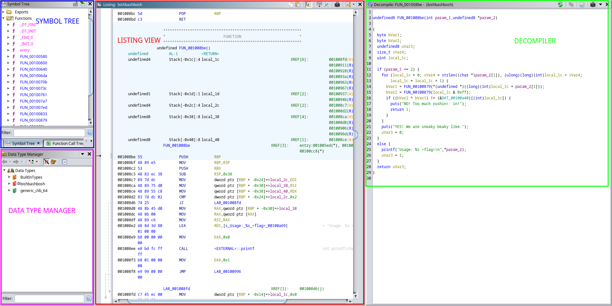

# Reverse engineering / Assembly crash course

[First](#background), some theoretical background on what reverse
engineering is, what assembly is, and some concepts which are good to
know. [Then](#methodology) there are some tips on how you practically go
about reversing a program. Some essential [tools](#tools) are listed which
you should install. [Finally](#extras), there are some extra tips and tricks
at the bottom.

## Background

In normal (forward) engineering, your task is to take ideas, concepts,
and designs, and turn them into a product, or piece of software. In
reverse engineering, it's the other way around. Given the output of the
engineering process, can you determine what the original design, concept,
or plan was? Practically, this often means reading a lot of code and trying
to put yourself in the shoes of the original program authors.

In CTFs, we are usually interested in reverse engineering binary programs. Most
often, the programs were originally written in C. (If they were written in
something else like C++, Go, Rust, or Swift, things get more challenging.) You
are usually given just the compiled program. Your task is then to:

1. Figure out what the program does
2. Figure out where the flag is
3. Make the program give you the flag / Use the program to figure out the flag

Below is a diagram of the usual compilation process in C. A compiler takes
your source code and produces assembly, which is fed to an assembler, which
produces a binary executable (program). This is the starting point for the
reverse engineer. Similarly to the normal compilation process, but in reverse,
you can use a disassembler to get assembly code from a compiled binary, and
use that with a decompiler to get an approximation of the original source code.


Here is some terminology:

- **Assembler**: Takes assembly code and gives machine code.
- **Disassembler**: Inverse of assembler. Takes machine code and gives assembly code (text).
- **Decompiler**: Inverse of compiler. Tries to reverse the compiled binary back to source code.

Below we go through some concepts which are good to know when dealing with
assembly and binaries.

### Static vs. Dynamic reversing

When reversing dynamically, you typically run the program and inspect its
behavior. For example using a debugger `gdb` or some other tracing program
(`strace` or `ltrace`). When reversing statically, you do not run the
application. Instead you read the disassembly and decompilation and think
about what it is doing.

### Assembly

Assembly code is what your CPU actually runs ([not actually, but close
enough](https://en.wikipedia.org/wiki/Microcode)). Or rather, your CPU runs
machine code, and assembly code is a one-to-one textual representation of the
machine code. Assembly code contains a list of instructions. Each instruction
performs some small task. You can think about assembly code like just a
programming language (because it is) where every instruction is very primitive.

There are many different types of assembly code: x86, ARM, MIPS, SPARC,
Power PC, z80, etc. In this document, we will focus on x86-64, the 64-bit
version of x86. It is the most common architecture on laptops, desktops,
and servers at the moment. ARM is most common on handheld devices such as
smartphones, etc. We will see what happens in the future, if ARM will take
over the desktop market.

When thinking about assembly as a programming language, we can look at some similarities and differences:

| x86                                                 | Programming language                   |
|-----------------------------------------------------|----------------------------------------|
| [Instruction](#instructions)                        | Statement                              |
| [Registers](#registers)                             | Variables                              |
| [Memory](#memory)                                   | No corresponding construct / Variables |
| [Untyped language](#representing-things-with-bytes) | Types exist                            |
| `cmp` and jump instructions                         | `if`, `while`, `for`                   |
| `call` and `ret`                                    | Calling and returning from functions   |

### Instructions

Here is a small C program:

```c
int a = 5;
int b = 7;
b += b;
b -= a;
int c = b;
c ^= a;
```

And here is a corresponding assembly program:

```
mov rax, 5
mov rbx, 7
add rbx, rbx
sub rbx, rax
mov rcx, rbx
xor rcx, rax
```

Notice how all binary operands store the result in the left-most register. They
generally take the form: `instr operand1, operand2` and perform `operand1 =
operand1 instr operand2`.

Here are some categories of instructions which are often used:

- **Integer operations**: `add`, `sub`, `mul`, `div`, `xor`, `and`, `or`, etc.
- **Conditional control flow**: `cmp`, `jeq`, `jne`, `jle`, etc.
- **Unconditional control flow**: `jmp`
- **Function call/ret**: `call`, `ret`
- **Moving between registers**: `mov`
- **Loading/storing in memory**: `mov rax, [rbx]`, `mov [rbx], rax`, etc.
- **Stack operations**: `push`, `pop`, `leave`

If you want a complete list of instructions, or just read the description
of some instruction, consult the following:

- Good online reference, based on the manual: https://www.felixcloutier.com/x86/
- Intel's complete manual of x86 (warning, 5000 pages!): https://software.intel.com/en-us/download/intel-64-and-ia-32-architectures-sdm-combined-volumes-1-2a-2b-2c-2d-3a-3b-3c-3d-and-4
- Just Google(/Chat-GPT?) it: `what does the x86 GF2P8AFFINEINVQB instruction do?`

### Disassembling with objdump

Example C code:

```c
#include <stdio.h>

int main() {
  for(int i = 0; i < 10; i++) {
    printf("i: %d\n", i);
  }
}
```

Compile with `gcc code.c` to get `a.out`. To disassemble `a.out` and get
the assembly code, use `objdump -d -M intel a.out`:

```
...
0000000000001139 <main>:
    1139:	55                   	push   rbp
    113a:	48 89 e5             	mov    rbp,rsp
    113d:	48 83 ec 10          	sub    rsp,0x10
    1141:	c7 45 fc 00 00 00 00 	mov    DWORD PTR [rbp-0x4],0x0
    1148:	eb 1d                	jmp    1167 <main+0x2e>
    114a:	8b 45 fc             	mov    eax,DWORD PTR [rbp-0x4]
    114d:	89 c6                	mov    esi,eax
    114f:	48 8d 05 ae 0e 00 00 	lea    rax,[rip+0xeae]        # 2004 <_IO_stdin_used+0x4>
    1156:	48 89 c7             	mov    rdi,rax
    1159:	b8 00 00 00 00       	mov    eax,0x0
    115e:	e8 cd fe ff ff       	call   1030 <printf@plt>
    1163:	83 45 fc 01          	add    DWORD PTR [rbp-0x4],0x1
    1167:	83 7d fc 09          	cmp    DWORD PTR [rbp-0x4],0x9
    116b:	7e dd                	jle    114a <main+0x11>
    116d:	b8 00 00 00 00       	mov    eax,0x0
    1172:	c9                   	leave
    1173:	c3                   	ret```
...
```

### Assembly syntax variations

When `objdump` is called with the `-M intel` flag, it prints the assembly
with the intel syntax. This is the preferred syntax. There is also the AT&T /
GNU AS / GAS syntax, which is the default, and is printed when running just
`objdump -d a.out`:

```
...
0000000000001139 <main>:
    1139:	55                   	push   %rbp
    113a:	48 89 e5             	mov    %rsp,%rbp
    113d:	48 83 ec 10          	sub    $0x10,%rsp
    1141:	c7 45 fc 00 00 00 00 	movl   $0x0,-0x4(%rbp)
    1148:	eb 1d                	jmp    1167 <main+0x2e>
    114a:	8b 45 fc             	mov    -0x4(%rbp),%eax
    114d:	89 c6                	mov    %eax,%esi
    114f:	48 8d 05 ae 0e 00 00 	lea    0xeae(%rip),%rax        # 2004 <_IO_stdin_used+0x4>
    1156:	48 89 c7             	mov    %rax,%rdi
    1159:	b8 00 00 00 00       	mov    $0x0,%eax
    115e:	e8 cd fe ff ff       	call   1030 <printf@plt>
    1163:	83 45 fc 01          	addl   $0x1,-0x4(%rbp)
    1167:	83 7d fc 09          	cmpl   $0x9,-0x4(%rbp)
    116b:	7e dd                	jle    114a <main+0x11>
    116d:	b8 00 00 00 00       	mov    $0x0,%eax
    1172:	c9                   	leave
    1173:	c3                   	ret
...
```

It is easy to tell them apart because AT&T uses a lot of % signs. The main
difference between the two is that they flip the order of operands. Example:

```
# C code
destination = source
rax = 5

# Intel
mov dst, src
mov rax, 5

# AT&T
mov src, dst
mov 5, %rax
```

### Registers

Registers are variables that live in the CPU. There are many of them, for
different purposes, but there are only 16 general-purpose registers which
you will normally deal with. Each of the general-purpose registers is 64-bits
or 8 bytes large. Some of them have special roles. Here they are:

- RAX, RBX, RCX, RDX
- RSI, RDI
- RSP - The stack pointer. Points to the top of the [stack](#the-stack).
- RBP - The base pointer. Points to the bottom of the current [stack](#the-stack) frame.
- R8, R9, R10, R11, R12, R13, R14, R15
- RIP - The instruction pointer. Points to the current instruction which is about to be executed.

Sometimes you may see other registers than these. For example `eax`,
`ebx`, `al`, or maybe `r10w`. These still refer to the previously mentioned
registers, but to different parts of them. For example, let's look at RAX
and its sub-registers:

```
63rd bit        31st bit       0th bit
[                           RAX] - 64 bit / 8 bytes, full register
                [           EAX] - Lowest 32 bits / 4 bytes of RAX
                        [    AX] - Lowest 16 bits / 2 bytes of RAX
                        [AH][AL] - AL: Lowest 8 bits / 1 byte of RAX
                                 - AH: Second lowest 8 bits / 1 byte of RAX
```

For a list and diagram over all registers, see here:

- https://sandpile.org/x86/gpr.htm

### Representing things with bytes

TODO:
- Everything can be represented with bytes

### Endianness

TODO:
- Big endian / MSB first - Natural when you think about it
- Little endian / LSB first - The reverse. What we actually have.

### Packing in Python

TODO:
- https://docs.python.org/3/library/struct.html
- https://docs.pwntools.com/en/latest/intro.html#packing-integers

### Memory

You can think about memory as a big array of bytes. The index to that array
is called an address. When you see memory operations in assembly, it can
be for different reasons: accessing local variables, global variables,
heap variables. etc. This is how you read and write to memory in x86:

```
# Read 1 byte from the address in RSI, to register CL:
mov CL, BYTE PTR [RSI]

# Write the contents of RAX (8 bytes) to the address in RDX:
mov QWORD PTR [RDX], RAX

# Read 2 bytes from the address in RDI plus 10, to register BX:
mov BX, WORD PTR [RDI + 10]
```

When multiple bytes are read at a time, they are read from `address`,
`address + 1`, etc. The size modifiers before the square brackets (`[...]`)
are like this:

| Modifier | Size    |
|----------|---------|
| `BYTE`   | 1 byte  |
| `WORD`   | 2 bytes |
| `DWORD`  | 4 bytes |
| `QWORD`  | 8 bytes |

TODO:
- How structures are placed in memory: Each field, adjacently, one after the other.

### The stack

TOOD:
- Push, pop
- Frames
- Where local variables are stored
- Return pointer

### Calling convetions

TODO:
- Mention order of arguments: rdi, rsi, etc.

### Stripped vs. Non-stripped

TODO:
- Strip symbols from a binary with `strip ./a.out`
- Use `nm ./a.out` to list the symbols in a binary

### Dynamic vs. Static linking

TODO:
- Compile with flag `-static` to get a static binary: `gcc -static code.c`
- Use `ldd ./a.out` to see if a binary is static or if it is dynamic and in
  that case which libraries it uses.

## Methodology

Some tips on how you actually reverse stuff.

### What to do first?

TODO:
- `file ./binary`
- `strings ./binary`
- `pwn checksec ./binary`
- open in ghidra and have a look
- run it. You could also run it first.
- When you know what you want to look at specifically, use gdb.

### Using Ghidra

When you open up Ghidra and go "wtf is this, I just want to reverse a binary",
this is how you do it:

1. File -> New Project
2. Choose Non-shared Project
3. Pick a directory to store the project in and a name
4. File -> Import File
5. Pick your binary
6. Click Ok two times
7. Double click your newly imported binary so that it opens in the CodeBrowser (green dragon icon)
8. Click Yes to analyzing the binary
9. Click Analyze without changing anything
10. 9 steps later, and you are done! Now the fun begins.

Here is an overview of Ghidra's interface (you might need to close the memory
map and script console to get exactly the same):



In the middle, you have the assembly listing. This shows the program's
assembly code and global variables in a linear fashion. On the right is
the decompiler, showing an approximative decompilation of the currently
visited function in the listing. The symbol tree to the top left is good for
searching for functions. Finally, in the data type manager in the bottom left,
you can create new structs which can be applied in the decompilation.

Navigate to the main function by searching for `main` in the Symbol
Tree. Alternatively you can use the amazing `g` hotkey to go to main: press
`g`, type `main`, press enter. You can also use `g` to go to any address. If
you can't find main, look for a `start` or `entry` function and then read
[Getting to main](#getting-to-main).

You will likely mostly be working in the decompiler view. There you can rename
variables with better names and you can give them more appropriate types:

- **Rename variable:** Right click variable name -> Rename variable. Or use the hotkey L.
- **Retype variable:** Right click variable name -> Retype variable. Or use the hotkey Ctrl + L.

How do you know when to retype a variable and what type to give it? This comes
a bit with experience, but you generally look at how the variable is used and
try to pick the type which "fits the best" with the rest of the code. "Fits the
best" could mean "gives the nicest decompilation", "produces the fewest casts",
etc. This does require being somewhat comfortable with the C type system.

### Getting to main

TODO:
- `__libc_start_main`: The first argument to the `__libc_start_main`
function call inside of the entry point function is a pointer to the real
`main` function.

### Using GDB

Start gdb like this: `gdb ./a.out`. Here are a bunch of commands you will
likely want to use:

| Command         | Comment                                                                  |
|-----------------|--------------------------------------------------------------------------|
| `r`             | Run the program                                                          |
| `r < input.txt` | Run the program. Feed in `input.txt` as stdin.                           |
| `r ARG1 ARG2`   | Run the program. Send `ARG1` and `ARG2` as command line arguments.       |
| `start`         | Run and stop at the first instruction.                                   |
| `b main`        | Set a breakpoint at function `main`                                      |
| `b *0x12345678` | Set a breakpoint at address `0x12345678`                                 |
| `pie br 0x1234` | Set a breakpoint at PIE offset `0x1234`. Requires GEF                    |
| `c`             | Continue running until next breakpoint.                                  |
| `ni`            | Next instruction. Steps one instruction forward. Will jump over `call`s. |
| `si`            | Step instruction. Steps one instruction forward. Will jump into `call`s. |
| `x/*`           | Examine memory, see below for more details.                              |
| `disass`        | Disassemble current function.                                            |
| `disass foo`    | Disassemble function `foo`.                                              |
| `i r`           | Print all registers.                                                     |
| `i r rax`       | Print only RAX.                                                          |
| `set $rax = 5`  | Sets RAX to 5.                                                           |
| `vmmap`         | View the virtual memory map.                                             |
| `q`             | Quit gdb.                                                                |

One very useful command needs to be explained in more detail: `x/*`, the examine memory command. You can use it to look at memory in many ways, here are some examples:

- `x/4gx 0x12345678` - Print 4 64-bit numbers in hexadecimal, from address 0x12345678.
- `x/10bd $rsp + 10` - Print 10 8-bit numbers in signed decimal form, from the address stored in `rsp` plus 10.
- `x/10i $rip` - Print the 10 next instructions.
- `x/s $rdx` - Print the string pointed to by `rdx`.

The general syntax is like this:

```
x/[count][size][format] [address]
```

Where `[count]` is an integer of how many to print. `[size]` says how large
each element is:

- `b` - byte - 1 byte
- `h` - half word - 2 bytes
- `w` - word - 4 bytes
- `g` - giant word - 8 bytes

The `[format]` argument can be any of the following:

- `x` - hexadecimal
- `o` - octal (probably works?)
- `u` - unsigned decimal
- `d` - signed decimal
- `i` - one instruction, the `[size]` is implicit.
- `s` - one string, until the next null byte, the `[size]` is implicit.

Finally, `[address]` can be a constant address, or an arithmetic
expression based on registers. Official documentation for examine:
https://ftp.gnu.org/old-gnu/Manuals/gdb-5.1.1/html_chapter/gdb_9.html#SEC56

### Ignoring the constant stuff

TODO:
- Try to find the part of the algorithm that depends on the input. Everything
that happened before that can be viewed as constant and can be extracted
using gdb if necessary.

## Tools

This section just lists tools and how to install them. For guidance on how
to use them, see the rest of the guide. The most basic tools are:

- `gdb` - a debugger
- `binutils` - contains `objdump`, `readelf`, `nm`, `strings`, etc...
- `gcc` - contains `gcc` (c compiler), `ldd`, etc...
- `strace` and `ltrace` - Trace which system and library calls a binary makes

These can be installed with your package manager. Example: `apt install gdb
binutils gcc strace ltrace`. And you likely already have them installed.

You will also need a reverse engineering suite. This is kind of like a
large IDE, but for reverse engineering. They usually contain a disassembler,
a decompiler, and lots more. Here are some options:

- Ghidra - https://ghidra-sre.org/
- IDA Freeware - https://hex-rays.com/ida-free/
- Binary Ninja - https://binary.ninja/

Ghidra is completely free, while IDA and Binja are both commercial, but
offer demo/trial/free versions. Binja has a student license!

To make your `gdb` experience nicer (read: bearable), you can (need to)
install GEF (https://github.com/hugsy/gef).

For convenient scripting around binaries and process interaction, install
the `pwntools` library for python (`pip install pwntools`). This is a must
have for pwn and a nice-to-have for reversing. Here is some documentation
for how to use it: https://docs.pwntools.com/en/latest/intro.html

## Extras

### Nice Ghidra config

